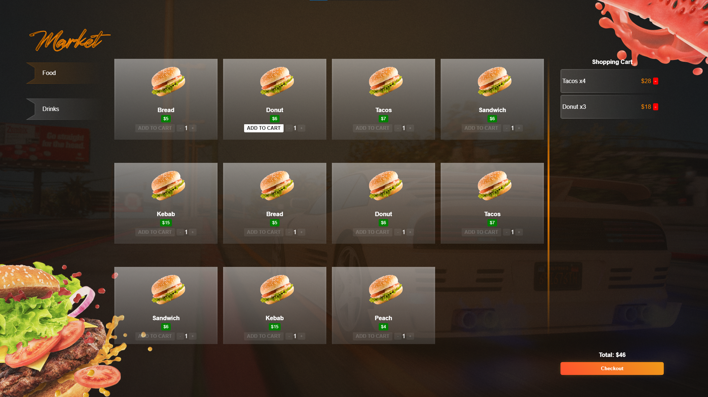

# qz_market

A modern market script for vRP2 that allows players to purchase food and drinks through a user-friendly NUI interface.

## Features

- **Food and Drinks Categories**: Separate sections for different types of consumables
- **Shopping Cart**: Add/remove items and adjust quantities before checkout
- **vRP2 Integration**: Fully compatible with vRP2 payment and inventory systems
- **NUI Interface**: Clean, responsive design with category selection
- **Quantity Selection**: Adjust item quantities before adding to cart
- **Real-time Cart Updates**: See total price and cart contents update instantly
- **Purchase Confirmation**: Clear cart and success messages after purchase
- **Close on ESC**: Press ESC key to close the market interface


## Installation

1. Place the `qz_market` folder in your server's resources directory
2. Add `start qz_market` to your `server.cfg` file
3. Start your server

## Configuration

The market items are configured through vRP2's edibles system. All items are already defined in:
- `cfg/items.lua` - Item definitions
- `cfg/edibles.lua` - Consumable item effects

To modify prices or add new items, edit the `categories` array in `html/script.js`.

## Usage

### For Players
1. Browse categories by clicking on the category tabs
2. Click "Add to Cart" to add items to your shopping cart
3. Adjust quantities using the +/- buttons
4. Remove items from cart by clicking the "-" button
5. Click "Checkout" to purchase all items in your cart
6. Press ESC or click outside the interface to close

## File Structure

```
qz_market/
├── client.lua           # Client-side event handling
├── server.lua           # Server-side purchase processing
├── fxmanifest.lua       # Resource manifest
├── html/
│   ├── index.html       # NUI interface
│   ├── script.js        # Frontend JavaScript
│   ├── style.css        # Interface styling
│   └── assets/          # Images and fonts
```

## Technical Details

### Dependencies
- vRP2 framework


### NUI Callbacks
- `purchase` - Handle cart checkout
- `close` - Close market interface

## Customization

### Adding New Items
1. Edit the `categories` array in `html/script.js`
2. Ensure the item exists in `cfg/items.lua` and `cfg/edibles.lua`
3. Use `itemCode` to reference the item (lowercase, no spaces)

### Modifying Prices
Update the `price` field in the product objects within the `categories` array.

### Changing Categories
Modify the `categories` array structure to add/remove categories or change their names.


## Screenshots



## Support

For issues and feature requests, please contact me on discord: `_quizo_`

## License

This project is licensed under the MIT License - see the LICENSE file for details.
